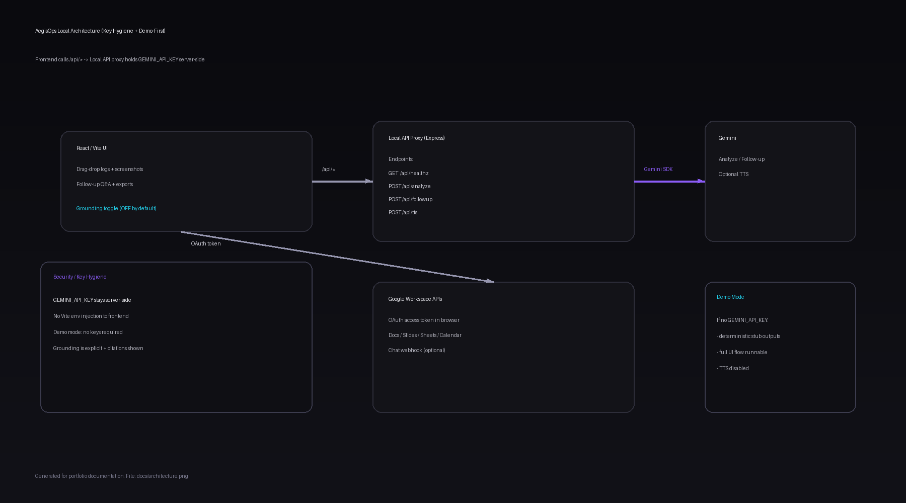

# AegisOps — GCP-based Multimodal SEV1 Incident Copilot (Personal Project)


In real SEV1 (Severity 1) incidents, the bottleneck usually isn’t the lack of telemetry. It’s that evidence is scattered: logs in terminals and alerts, dashboards captured as screenshots, and decisions living in ad-hoc chat messages.

I built **AegisOps** as a repeatable workflow that compresses:

`collect → reason → decide → communicate`

into a single, reviewable incident report.

## Demo / Links

- Demo video: https://youtu.be/FOcjPcMheIg
- Live demo (Google AI Studio): https://ai.studio/apps/drive/1nInCvCJjSXy0IQGiDeK9gbsjjhhPqtlg?fullscreenApplet=true

## What It Does

- **Input:** raw text logs + monitoring screenshots
- **Output:** a structured JSON incident report:
  - severity, RCA (root cause analysis) hypotheses, prioritized actions, timeline, prevention recommendations
  - a short **reasoning trace** (Observations / Hypotheses / Decision Path)
- **Follow-up Q&A** grounded on the generated report context
- **Optional:** on-call audio briefing (TTS, text-to-speech)
- **Optional:** export artifacts to Google Workspace (Docs/Slides/Sheets/Calendar, plus Chat webhook)

## My Scope (Personal Project)

- Built the end-to-end workflow: React/Vite UI + local API proxy (Express) + report schema + follow-up Q&A.
- Implemented JSON extraction/repair so the UI stays stable even when model output is messy.
- Added demo-first reproducibility (deterministic demo mode when `GEMINI_API_KEY` is missing).
- Enforced payload guardrails for multimodal inputs (image limits + partial-failure tolerance).
- Kept secrets off the client (server-side key handling; no Vite env injection).

## Architecture

The key design goal is **key hygiene**: the Gemini API key must never be shipped to the browser.



```mermaid
flowchart LR
  UI[React/Vite UI] -->|/api/*| API[Local API Proxy (Express)]
  API -->|Gemini| LLM[Gemini Models]
  UI -->|OAuth token| GWS[Google Workspace APIs]
```

- The frontend calls a local API (`/api/analyze`, `/api/followup`, `/api/tts`).
- The API reads `GEMINI_API_KEY` server-side and calls Gemini.
- Grounding (`googleSearch` tool) is **OFF by default** and must be explicitly enabled.

## Sample Inputs (For Reviewers)

You can drag & drop sample inputs from `samples/` into the UI:

- `samples/logs/*.txt`
- `samples/screenshots/*.png`

## Run Locally (One Command)

### Prerequisites

- Node.js 18+

### Quick Start

```bash
npm install && npm run dev
# or: make demo-local
```

- UI: `http://127.0.0.1:3000`
- API: `http://127.0.0.1:8787`

### Environment Variables

Copy `.env.example` to `.env` and fill what you need.

```env
# If missing, the API runs in deterministic demo mode (no external LLM calls).
GEMINI_API_KEY=

# Optional: enable real Google OAuth for Workspace integration (otherwise the UI uses demo auth).
VITE_GOOGLE_CLIENT_ID=

# Optional: community integrations
VITE_FORMSPREE_ENDPOINT=
VITE_DISQUS_SHORTNAME=
VITE_DISQUS_IDENTIFIER=aegisops-community
VITE_GISCUS_REPO=
VITE_GISCUS_REPO_ID=
VITE_GISCUS_CATEGORY=
VITE_GISCUS_CATEGORY_ID=

# Optional: AdSense
VITE_ADSENSE_CLIENT=ca-pub-xxxxxxxxxxxxxxxx
VITE_ADSENSE_SLOT=1234567890

# Optional: Teachable Machine image classifier (client-side)
# Use either base folder URL (.../model/) or direct model.json URL.
VITE_TM_MODEL_URL=
```

AdSense review helpers are included in `public/ads.txt`, `public/robots.txt`, `public/sitemap.xml`, `public/about.html`, `public/compliance.html`, and `public/_headers`.

### Teachable Machine (Optional)

When `VITE_TM_MODEL_URL` is set, AegisOps can run **local browser-side image classification** before Gemini analysis:

- uploaded screenshots are scored by your Teachable Machine model
- high-confidence labels are appended to log context as `[TM] ...` lines
- failures are non-blocking (analysis continues without TM signals)

## Demo Mode (No Keys Required)

If `GEMINI_API_KEY` is not set, the API switches to **demo mode**:

- analysis returns a deterministic stub report (based on the provided logs)
- follow-up Q&A returns a deterministic helper response
- TTS is disabled

This keeps the project easy to review and runnable without external credentials.

## Notes / Limitations

- Workspace export features require OAuth scopes; in demo mode those calls are not executed.
- This is a portfolio project focused on repeatability, safety-by-default, and operational UX.

## Glossary (first-time readers)
- SEV1: Severity 1 incident (highest urgency)
- RCA: Root Cause Analysis
- TTS: Text-to-Speech
- OAuth: Open Authorization (browser-based consent flow)
- LLM: Large Language Model
