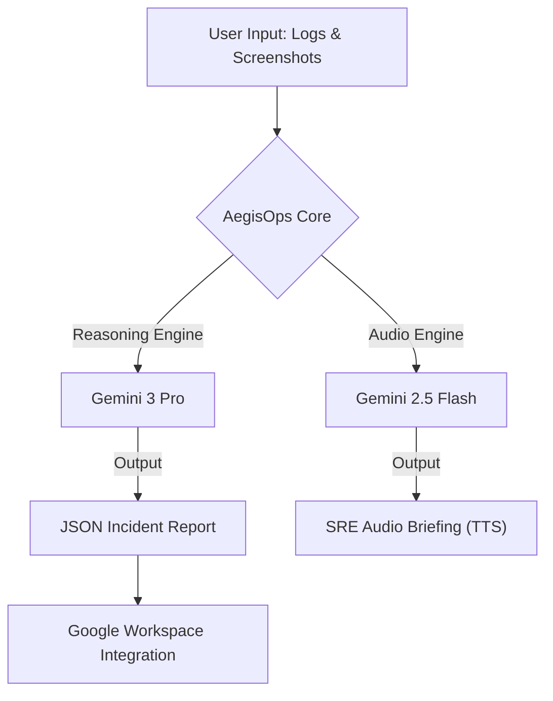

# 🛡️ AegisOps – AI-Powered SRE Incident Doctor

> **"Turn chaos into clarity."**
> AegisOps is an autonomous incident response assistant that integrates deeply with Google Workspace to automate Site Reliability Engineering (SRE) workflows using Gemini 3 Pro.

<div align="center">

[](https://youtu.be/FOcjPcMheIg)

### 📺 [Watch the Full Demonstration Video](https://youtu.be/FOcjPcMheIg)
### 🔴 [Try the Live Demo (Google AI Studio)](https://ai.studio/apps/drive/1nInCvCJjSXy0IQGiDeK9gbsjjhhPqtlg?fullscreenApplet=true)

</div>

<br/>

   

---

## 💡 The Problem: "War Room Chaos"

In the heat of a critical incident (SEV1), SREs face three challenges:
1.  **Information Overload:** Scanning thousands of log lines and scattered Grafana dashboards.
2.  **Context Switching:** Jumping between terminals, Slack, and docs slows down mitigation.
3.  **Communication Overhead:** Stakeholders demand updates while engineers are trying to fix the issue.

**AegisOps solves this by acting as an AI Co-pilot that handles the analysis and administrative toil, letting engineers focus on the fix.**

---

## 🏗️ System Architecture: Dual-Model Strategy

AegisOps employs a specialized **Dual-Model Architecture** to optimize for both deep reasoning and user experience:



### 1. The Brain: `gemini-3-pro-preview`
*   **Role:** Root Cause Analysis (RCA) & Report Generation.
*   **Why:** Complex incidents require reasoning across modalities (Time-series graphs + Text logs). Gemini 3 Pro's long context window and superior logical deduction capabilities allow it to correlate a spike in a Grafana chart with a specific error log timestamp.

### 2. The Voice: `gemini-2.5-flash-preview-tts`
*   **Role:** Text-to-Speech (TTS) Briefing.
*   **Why:** During an outage, SREs are often away from their keyboards (war rooms, phone calls). The Flash model provides low-latency, high-fidelity speech synthesis, converting the executive summary into an audio briefing.

---

## ✨ Key Features

### 🧠 Advanced AI Analysis
*   **Multimodal Intelligence:** Simply drag and drop log files (`.log`, `.txt`) and dashboard screenshots (`.png`, `.jpg`) together.
*   **Reasoning Engine:** Displays the AI's "Chain of Thought," explaining *why* it reached a conclusion (e.g., *"Detected memory spike at 14:05 coinciding with OOM kill log"*).
*   **Google Search Grounding:** Cross-references obscure error codes with live web data to suggest proven mitigation steps (RAG-lite).

### ☁️ Deep Google Workspace Integration
AegisOps transforms analysis into action using the **Google Workspace APIs**:
*   **Gmail:** Search and import alert emails directly from PagerDuty/Datadog.
*   **Google Drive:** Securely fetch log archives and screenshot assets.
*   **Google Docs:** Auto-draft a "Gold Standard" Post-Mortem document.
*   **Google Slides:** Generate an executive summary deck for leadership review.
*   **Google Sheets:** Sync incident metadata to a central dataset for MTTR tracking.
*   **Google Calendar:** Auto-schedule the Post-Mortem Review meeting.
*   **Google Chat:** Dispatch formatted summary cards to team channels via Webhook.

---

## 🚀 How to Run locally

### Prerequisites
*   Node.js (v18+) or a modern browser environment.
*   **Gemini API Key:** Get one at [Google AI Studio](https://aistudio.google.com/).

### Installation

1.  **Clone the repository:**
    ```bash
    git clone https://github.com/KIM3310/aegisops.git
    cd aegisops
    ```

2.  **Set Environment Variables:**
    Create a `.env` file (or set in your IDE):
    ```env
    API_KEY=your_gemini_api_key_here
    ```

3.  **Run the application:**
    ```bash
    npm install
    npm run dev
    ```

### ⚡ Demo Mode (Zero-Config)
AegisOps includes a robust **Demo Mode**. If you do not provide a Google Client ID for OAuth, the app automatically switches to simulation mode:
*   Simulates Google Login.
*   Provides mock data for Gmail and Drive imports.
*   Allows full exploration of the UI and AI features without a GCP setup.

---

## 👨‍💻 About the Developer

**Doeon Kim**
*AI-Native SRE & Full Stack Engineer*

> **"As someone who has experienced the chaos of 3 AM SEV1 incidents, I built AegisOps to be the calm, rational co-pilot I always wished I had."**

Building resilient systems powered by Generative AI.
This project was built for the **Google Gemini Developer Competition**.

[GitHub](https://github.com/KIM3310) • [LinkedIn](https://www.linkedin.com/in/doeon-kim-4742a2388)
