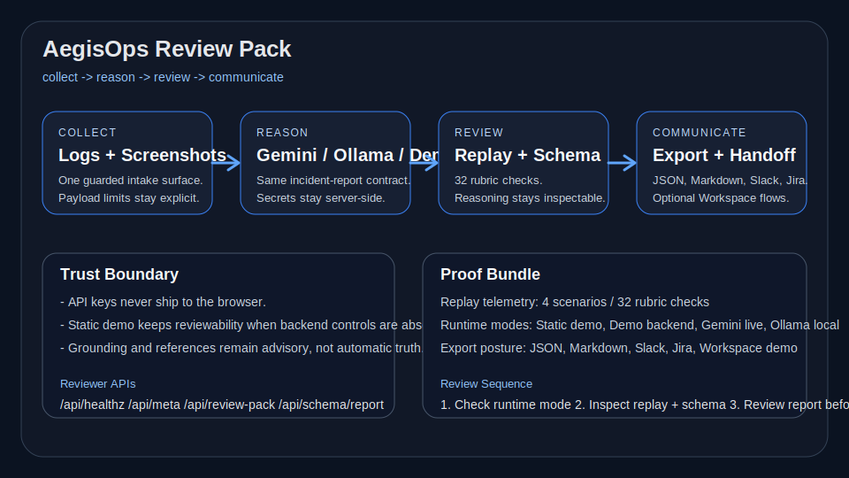
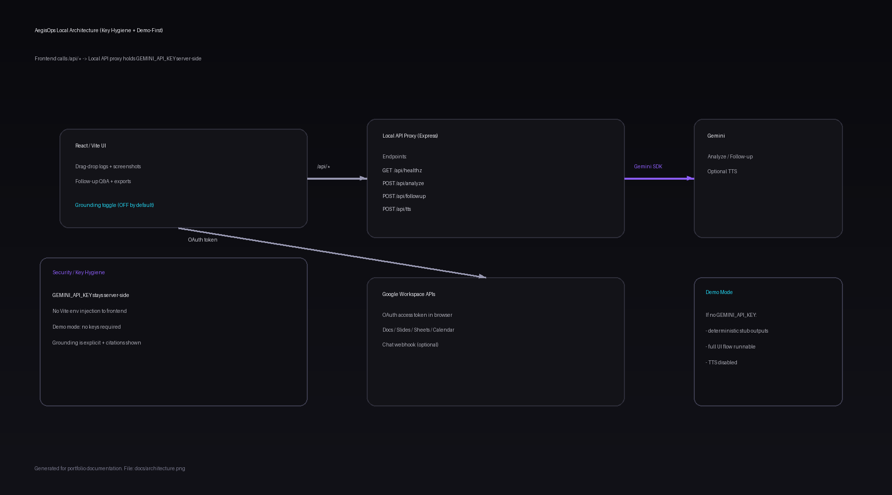

# AegisOps — Multimodal SEV1 Incident Copilot


In real SEV1 incidents, the hard part is rarely missing telemetry. The harder part is turning scattered evidence from logs,
screenshots, and alerts into a report that someone else can review quickly.

**AegisOps** compresses:

`collect → reason → decide → communicate`

into a single, reviewable incident report.

## Portfolio posture
- Review this repo as an operator surface with multiple runtime postures (demo, Gemini, Ollama), not as a single always-live environment.
- The live-session pack, review pack, and replay suite matter more than the static UI alone when you judge the product story.


## Role signals
- **AI engineer:** multimodal evidence handling, grounding controls, and structured incident output are all first-class.
- **Solution / cloud architect:** live/demo posture, reviewer routes, and operator-role boundaries are visible in the product surface.
- **Field / solutions engineer:** the repo is easy to walk from screenshot + logs -> incident report -> reviewer bundle.

## Product Family

AegisOps is the multimodal copilot surface in the broader `Aegis` incident-analysis product family.

Companion repo:

- `Aegis-Air`: local-first / air-gapped incident review engine for teams that cannot send telemetry to public APIs

## Demo / Links

- Demo video: https://youtu.be/FOcjPcMheIg
- Cloudflare Pages demo: https://aegisops-ai-incident-doctor.pages.dev
- Google AI Studio demo: https://ai.studio/apps/drive/1nInCvCJjSXy0IQGiDeK9gbsjjhhPqtlg?fullscreenApplet=true

## Runtime vs review/demo surfaces

- Primary runtime: the React/Vite UI (`App.tsx`, `components/`, `hooks/`) plus the Express API in `server/` is the main product surface.
- Review/demo surfaces: the Cloudflare Pages demo, `docs/`, and `samples/` are there so reviewers can inspect the incident flow without wiring live providers first.
- Repo map: root `*.tsx` files are the app shell, `scripts/` holds replay/load helpers, and `infra/` carries deployment material.

## Review Pack At A Glance

- Reviewer API surface: `GET /api/healthz`, `GET /api/meta`, `GET /api/review-pack`, `GET /api/schema/report`
- Session history API: `GET /api/live-sessions`, `GET /api/live-sessions/:sessionId`
- Live session surface: `GET /api/live-session-pack`
- Incident quality proof: replay suite with 4 scenarios / 32 rubric checks
- Provider comparison surface: `GET /api/evals/providers`
- Runtime posture: static demo, demo backend, Gemini live, Ollama local
- Export posture: JSON, Markdown, Slack, Jira, plus optional Workspace flows

## Review Flow

1. `GET /api/healthz` -> confirm deployment mode and backend posture.
2. `GET /api/live-session-pack` -> inspect realtime modality, operator roles, and live handoff routes.
3. `GET /api/live-sessions` -> verify that live incident loops remain reviewable across multiple requests.
4. `GET /api/review-pack` -> inspect replay proof, runtime modes, and trust boundary.
5. `GET /api/evals/providers` -> compare demo/Gemini/Ollama tradeoffs before making runtime-quality or cost claims.
6. `GET /api/schema/report` -> verify incident contract and export boundary.
7. `docs/review-pack.svg` + `docs/architecture.png` -> read reviewer flow and key hygiene in one glance.



## Further Reading

- Architecture: [`docs/solution-architecture.md`](docs/solution-architecture.md)
- Overview: [`docs/executive-one-pager.md`](docs/executive-one-pager.md)
- Discovery notes: [`docs/discovery-guide.md`](docs/discovery-guide.md)

## What It Does

- **Input:** raw text logs + monitoring screenshots
- **Output:** a structured JSON incident report:
  - severity, RCA (root cause analysis) hypotheses, prioritized actions, timeline, prevention recommendations
  - a short **reasoning trace** (Observations / Hypotheses / Decision Path)
- **Included incident replay suite:** rubric-based checks for severity, tags, title quality, actionability, timeline
  coverage, reasoning structure, and confidence bands
- **Follow-up Q&A** grounded on the generated report context
- **Optional:** on-call audio briefing (TTS, text-to-speech)
- **Optional:** export artifacts to Google Workspace (Docs/Slides/Sheets/Calendar, plus Chat webhook)

## Scope

- Built the end-to-end workflow: React/Vite UI + local API proxy (Express) + report schema + follow-up Q&A.
- Implemented JSON extraction/repair so the UI stays stable even when model output is messy.
- Added a fallback demo mode when `GEMINI_API_KEY` is missing.
- Enforced payload guardrails for multimodal inputs (image limits + partial-failure tolerance).
- Kept secrets off the client (server-side key handling; no Vite env injection).
- Exposed replay results through `GET /api/evals/replays` and `npm run eval:replays`.
- Exposed service posture through `GET /api/meta` and report contract guidance through `GET /api/schema/report`.

## Incident Replay Evals

This repo includes a small replay harness for incident analysis quality:

- suite source: `evals/incidentReplays.ts`
- scoring logic: `server/lib/replayEvals.ts`
- reviewer script: `npm run eval:replays`
- API summary: `GET /api/evals/replays`

The current suite covers 4 scenarios / 32 rubric checks. For the scoring rubric and case design, see
`docs/INCIDENT_REPLAY_EVALS.md`.

## Service-Grade Surfaces

AegisOps now exposes four explicit review surfaces for operators and reviewers:

- `GET /api/healthz`
  - current deployment mode, provider, limits, cache posture, and next action
- `GET /api/meta`
  - product workflow, runtime modes, replay summary, operator checklist, and report contract summary
- `GET /api/live-session-pack`
  - realtime modality map, operator roles, reliability posture, and live review routes
- `GET /api/live-sessions`
  - persisted incident session history with lane-aware summaries and detailed reviewer timelines
- `GET /api/review-pack`
  - operator journey, trust boundary, replay evidence, export posture, and reviewer links
- `GET /api/schema/report`
  - required incident-report fields, export formats, field guidance, and input guardrails

This is intentional: the repo should be reviewable as a service surface, not just a frontend demo.

## Supporting Files

- `docs/review-pack.svg`
- `docs/architecture.png`
- `docs/live-session-pack.md`
- `docs/INCIDENT_REPLAY_EVALS.md`
- `samples/logs`
- `samples/screenshots`

## Architecture

The key design goal is **key hygiene**: the Gemini API key must never be shipped to the browser.



```mermaid
flowchart LR
  UI[React/Vite UI] -->|/api/*| API[Local API Proxy (Express)]
  API -->|Gemini| LLM[Gemini Models]
  UI -->|OAuth token| GWS[Google Workspace APIs]
```

- The frontend calls a local API (`/api/analyze`, `/api/followup`, `/api/tts`).
- The API reads `GEMINI_API_KEY` server-side and calls Gemini.
- Grounding (`googleSearch` tool) is **OFF by default** and must be explicitly enabled.

## Sample Inputs

You can drag & drop sample inputs from `samples/` into the UI:

- `samples/logs/*.txt`
- `samples/screenshots/*.png`

## Run Locally (One Command)

### Prerequisites

- Node.js 18+

### Quick Start

```bash
npm install && npm run dev
# or: make demo-local
```

- UI: `http://127.0.0.1:3000`
- API: `http://127.0.0.1:8787`

### Environment Variables

Copy `.env.example` to `.env` and fill what you need.

```env
# If missing, the API runs in demo mode (no external LLM calls).
GEMINI_API_KEY=

# LLM provider selection:
# - auto   : Gemini when key exists, otherwise demo mode
# - demo   : always use demo mode
# - gemini : Gemini mode (falls back to demo when key is missing)
# - ollama : local Ollama mode (offline)
LLM_PROVIDER=auto

# Optional: Ollama local endpoint + models (used when LLM_PROVIDER=ollama)
OLLAMA_BASE_URL=http://127.0.0.1:11434
OLLAMA_MODEL_ANALYZE=llama3.1:8b
OLLAMA_MODEL_FOLLOWUP=llama3.1:8b

# Optional: protect /api/settings/api-key with an admin token.
# Send via Authorization: Bearer <token> or x-api-settings-token header.
API_KEY_SETTINGS_TOKEN=

# Optional: allow /api/settings/api-key from non-localhost clients.
# Default is false (localhost only).
ALLOW_REMOTE_API_KEY_SETTINGS=false

# Optional: API bind host (default: 127.0.0.1).
# Set HOST=0.0.0.0 only when you explicitly need remote/LAN access.
HOST=127.0.0.1

# Optional: trust reverse proxy headers (X-Forwarded-For).
TRUST_PROXY=false

# Optional: Gemini upstream timeout in milliseconds.
GEMINI_TIMEOUT_MS=45000

# Optional: Gemini retry policy (exponential backoff for transient 429/5xx/timeout).
GEMINI_RETRY_MAX_ATTEMPTS=3
GEMINI_RETRY_BASE_DELAY_MS=400

# Optional: API request body and payload guardrails.
REQUEST_BODY_LIMIT_MB=25
MAX_IMAGE_BYTES=5000000
MAX_QUESTION_CHARS=4000
MAX_TTS_CHARS=5000

# Optional: in-memory cache for duplicate analyze requests.
ANALYZE_CACHE_TTL_SEC=300
ANALYZE_CACHE_MAX_ENTRIES=200

# Optional: enable real Google OAuth for Workspace integration (otherwise the UI uses demo auth).
VITE_GOOGLE_CLIENT_ID=

# Optional: community integrations
VITE_FORMSPREE_ENDPOINT=
VITE_DISQUS_SHORTNAME=
VITE_DISQUS_IDENTIFIER=aegisops-community
VITE_GISCUS_REPO=
VITE_GISCUS_REPO_ID=
VITE_GISCUS_CATEGORY=
VITE_GISCUS_CATEGORY_ID=

# Optional: AdSense
VITE_ADSENSE_CLIENT=ca-pub-xxxxxxxxxxxxxxxx
VITE_ADSENSE_SLOT=1234567890

# Optional: Teachable Machine image classifier (client-side)
# Use either base folder URL (.../model/) or direct model.json URL.
VITE_TM_MODEL_URL=
```

For local dev, Vite binds to `127.0.0.1` by default.  
If you need LAN/device testing, set `VITE_DEV_HOST=0.0.0.0` before `npm run dev`.

You can also provide Gemini key from the UI (`API Key` button in top bar).  
That runtime key is kept in backend memory only and resets when the API server restarts.

Google OAuth access tokens are now restored from session only while valid; expired tokens are cleared automatically.

AdSense review helpers are included in `public/ads.txt`, `public/robots.txt`, `public/sitemap.xml`, `public/about.html`, `public/compliance.html`, and `public/_headers`.

### Teachable Machine (Optional)

When `VITE_TM_MODEL_URL` is set, AegisOps can run **local browser-side image classification** before Gemini analysis:

- uploaded screenshots are scored by your Teachable Machine model
- high-confidence labels are appended to log context as `[TM] ...` lines
- failures are non-blocking (analysis continues without TM signals)

## Demo Mode (No Keys Required)

If `GEMINI_API_KEY` is not set, the API switches to **demo mode**:

- analysis returns a deterministic review-only report based on the provided logs
- follow-up Q&A returns a deterministic helper response
- TTS is disabled

This keeps the project runnable without external credentials.

The replay suite also runs in demo mode, so the current score can be reproduced locally.

The Cloudflare Pages deployment also stays usable without a backend. If `/api/*` is unavailable, the frontend falls back to:

- deterministic local incident analysis in the browser
- local replay-suite scoring
- review-only follow-up answers and explicit Workspace export placeholders

## Ollama Offline Mode (No Cloud LLM)

Use this when you want offline local inference.

1. Install and run Ollama locally.
2. Pull a model:

```bash
ollama pull llama3.1:8b
```

3. Set `.env`:

```env
LLM_PROVIDER=ollama
OLLAMA_BASE_URL=http://127.0.0.1:11434
OLLAMA_MODEL_ANALYZE=llama3.1:8b
OLLAMA_MODEL_FOLLOWUP=llama3.1:8b
```

4. Start app:

```bash
npm run dev
```

Notes:
- In `ollama` mode, Gemini API key runtime settings are disabled.
- TTS endpoint is treated as unavailable (`audioBase64` is empty).
- If Ollama is not running/reachable, analyze/follow-up endpoints return `502` with a connection hint.

## Notes / Limitations

- Workspace export features require OAuth scopes; in demo mode those calls are not executed.
- This project is focused on repeatable local review, safety-by-default, and operational UX.

## Glossary (first-time readers)
- SEV1: Severity 1 incident (highest urgency)
- RCA: Root Cause Analysis
- TTS: Text-to-Speech
- OAuth: Open Authorization (browser-based consent flow)
- LLM: Large Language Model

## Local Verification
```bash
npm install
npm run typecheck
npm run test
npm run eval:replays
npm run build
```

## Repository Hygiene
- Keep runtime artifacts out of commits (`.codex_runs/`, cache folders, temporary venvs).
- Prefer running verification commands above before opening a PR.
