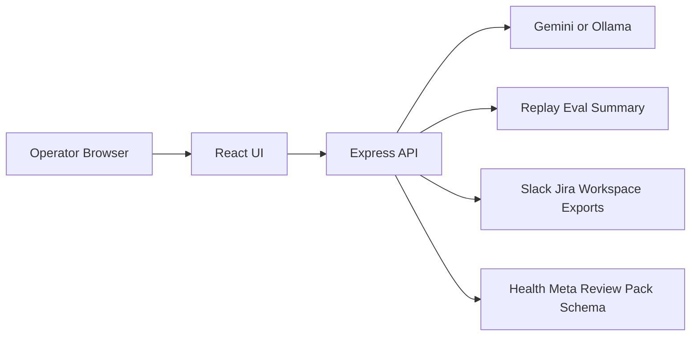

# AegisOps Solution Architecture

## Goal

AegisOps turns multimodal incident evidence into a reviewable incident report without exposing provider secrets to the browser.

## System boundary

- `React/Vite UI`
  - collects screenshots, logs, and operator context
  - renders runtime posture, review pack, and replay proof
- `Express API`
  - validates payloads
  - owns model keys
  - normalizes report output
  - exposes reviewer surfaces
- `Model runtime`
  - Gemini live mode
  - Ollama local mode
  - static/demo fallback mode
- `Export boundary`
  - JSON
  - Markdown
  - Slack/Jira
  - optional Google Workspace artifacts

## Deployment topology

## Reliability posture

- Browser never owns the Gemini API key.
- Review surfaces are available even when the live model is unavailable.
- Replay evals provide a deterministic quality floor before a reviewer trusts the live path.
- Report schema is explicit, so downstream exports do not depend on loose model formatting.

## Security and trust boundary

- provider keys stay on the server
- multimodal uploads are bounded and validated before model invocation
- runtime modes are explicit: demo, Gemini live, Ollama local
- export routes are separated from incident reasoning routes

## Reviewer flow

1. Open `/api/healthz` to confirm runtime mode.
2. Open `/api/review-pack` to inspect replay proof and trust boundary.
3. Open `/api/schema/report` to verify the contract.
4. Run one incident path through analyze -> export -> follow-up.

## What makes this useful for an AI engineer

- multimodal input normalization
- structured output stabilization
- fallback modes
- evaluation-backed quality claims
- explicit contract surface for downstream systems

## What makes this useful for a solutions architect

- clear browser/server/provider boundary
- review-first API surface
- export and integration boundary separated from inference boundary
- production hardening path is visible without reading the whole codebase

## Production hardening next steps

- add request-level audit persistence for exports
- add SSO/RBAC around incident visibility
- add deployment-specific env profiles and IaC
- add latency and cost scorecard per runtime mode
